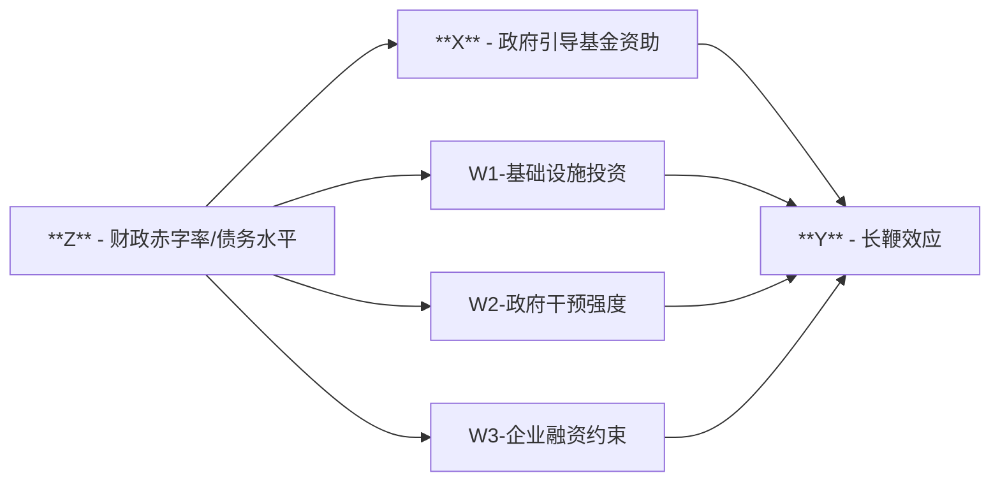

# 工具变量合理性分析

在上一章中 ([如何借助 AI 寻找工具变量？](08_findit_IV_example.html))，我介绍了一个例子，AI 推荐了「地方政府财政赤字率」和「地方债务水平」作为工具变量。

在使用这两个变量之前，我们需要对它们作为工具变量的合理性进行分析。以下是 AI 对这两个工具变量的外生性、相关性和排他性三个维度的分析，以及可能存在的后门路径。


## 三个分析要点

### 外生性分析（Exogeneity）

地方政府财政赤字率与债务水平主要取决于：

- 地方宏观经济状况（如经济周期波动、产业结构调整）。
- 地方政府财政支出管理政策（如财政预算、债务发行计划）。

这些因素通常由地区经济整体状况和政策环境决定，**个别企业的供应链管理行为或长鞭效应很难直接影响地方政府的财政赤字率或债务水平**。

因此，在充分控制地区、行业和企业层面特征后，这两个变量作为工具变量具有较好的外生性。

### 相关性分析（Relevance）

地方政府的财政赤字率和债务水平直接影响地方政府用于产业扶持政策的预算规模与意愿：

- 财政赤字率或债务水平较高时，地方政府可能迫于经济增长或财政压力的需要，更积极地投放政府引导基金，以刺激经济增长、稳定就业或扩大税基；
- 财政健康状况好的地区，政府可能更倾向于市场化运作，对引导基金的投放力度或需求可能相对较低。

因此，这两个指标在逻辑上和实践中均可能显著地决定政府引导基金的投放决策，满足相关性条件。

### 排他性分析（Exclusion Restriction）

排他性要求工具变量仅通过影响政府引导基金（$Z \rightarrow D$）来影响长鞭效应（$Y$），不存在其他直接渠道（$Z \rightarrow Y$）。  
然而，这一假设可能存在潜在问题，特别是财政赤字率或债务水平可能会通过其他渠道直接影响企业供应链的波动性（长鞭效应）。这些潜在渠道需被明确识别和控制，以满足工具变量的排他性。


## 不满足排他性的三种潜在渠道

下面详细分析三个最重要的可能渠道（$W_1, W_2, W_3$）。财政压力（赤字或债务）可能通过以下三个潜在渠道 ($W$) 直接或间接影响企业供应链稳定性：

### W1：基础设施投资（Infrastructure Investment）

- **渠道机制**：
  地方政府财政压力增加时，可能削减基础设施投资预算（如交通、物流、通信基础设施），导致企业物流成本增加、供应链效率下降，从而加剧长鞭效应。

- **明确定义与度量方式**：
  - **基础设施投资额**：地方政府年度基础设施投资总额（亿元）。
  - **基础设施投资强度**：基础设施投资额占地区 GDP 比重（%）。

- **数据来源推荐**：
  - 中国统计年鉴（地区基础设施建设投资）。
  - Wind 数据库（地区固定资产投资完成额）。


### W2：政府干预（Government Intervention）

- **渠道机制**：
  财政压力较大的地区，政府可能通过行政手段干预企业生产经营活动，以稳定地方经济增长、保就业，从而直接影响企业的供应链管理策略和库存决策，导致长鞭效应变化。

- **明确定义与度量方式**：
  - **政府补贴强度**：地方政府对辖区内企业的财政补贴总额占 GDP 的比重（%）。
  - **政府与市场关系指数**：可用中国市场化指数中的政府干预子指数。

- **数据来源推荐**：
  - 地方财政预算执行报告（政府补贴支出数据）。
  - 王小鲁《中国分省份市场化指数》中的政府干预指数。


### W3：融资约束（Financing Constraints）

- **渠道机制**：
  地方财政压力高时，政府可能挤占金融市场资源（如增加地方债发行规模），导致企业信贷获取成本上升或融资难度增加，企业流动资金短缺，从而影响企业的库存管理、采购策略，进一步引发或加剧长鞭效应。

- **明确定义与度量方式**：
  - **企业融资约束指标（SA-index）**：基于上市公司财务数据计算的融资约束程度指标。
  - **地区信贷资源紧张程度**：金融机构人民币贷款余额增长率或中小企业贷款比重。

- **数据来源推荐**：
  - CSMAR、Wind 数据库（企业 SA-index 指标）。
  - 地方金融运行报告（地区信贷数据、中国人民银行各分行统计报告）。


## 如何关闭这些潜在渠道？

为满足 IV 的排他性假设，应在实证模型中明确控制上述三个变量，以关闭财政赤字率或债务水平对企业长鞭效应的潜在直接影响路径。

### 推荐控制变量（精简后的三选方案）：

| 变量类型 (W)    | 推荐控制变量                                                           | 具体数据来源              |
| --------------- | ---------------------------------------------------------------------- | ------------------------- |
| W1 基础设施投资 | 基础设施投资强度（基础设施投资额/GDP）                                 | 中国统计年鉴、Wind        |
| W2 政府干预     | 政府补贴强度（地方政府补贴额/GDP）或 政府与市场关系指数                | 地方财政报告、市场化指数  |
| W3 融资约束     | 企业融资约束指标（SA-index）或地区信贷紧张程度（人民币贷款余额增长率） | CSMAR、Wind、央行分行数据 |


### 图示（因果路径与控制变量）

通过 DAG 图进一步明确因果链条及潜在的后门路径：

````md

````


**说明：**

- **主路径**：财政压力 → 政府引导基金 → 长鞭效应（本文所要识别的核心路径）。
- **潜在替代路径（需要关闭）**：
  - 财政压力 → 基础设施投资 → 长鞭效应
  - 财政压力 → 政府干预 → 长鞭效应
  - 财政压力 → 企业融资约束 → 长鞭效应

通过在回归模型中同时控制 W1、W2、W3 三个变量，可以有效关闭上述后门路径，从而满足排他性要求。


## 小结与实施建议

工具变量整体评价：

| 工具变量       | 外生性 | 相关性 | 排他性（控制W1-W3后） |
| -------------- | ------ | ------ | --------------------- |
| 地方财政赤字率 | 强     | 强     | 较强（需控制 W1-W3）  |
| 地方债务水平   | 强     | 强     | 较强（需控制 W1-W3）  |

具体实施建议：

- 在实证回归模型中纳入明确定义和可观测的 W1、W2 和 W3 变量；
- 进行 IV 第一阶段回归，确保工具变量的强相关性；
- 在 IV 第二阶段回归后，实施稳健性检验，包括不同 W 变量的组合方式，检验估计结果的稳健性；
- 结合 DAG 图在论文正文中展示识别策略，提升实证分析的严谨性与说服力。

以上分析为工具变量合理性的深入论证，后续实证分析可在此基础上展开。