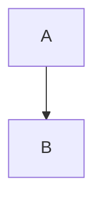

<style>
/*一级标题局中*/
section.lead h1 {
  text-align: center; /*其他参数：left, right*/
}
section {
  font-size: 22px;      /* 正文字号 */
}
h1 {
  color: blackyellow;   /* 标题的颜色 */
  /*font-size: 28px; */ /* 标题的字号, 其它标题也可以这样修改 */
}
h2 {
  color: green;
}
h3 {
  color: darkblue;
}
h4 {
  color: brown;
}
/* 右下角添加页码 */
section::after {
  content: attr(data-marpit-pagination) '/' attr(data-marpit-pagination-total); 
}
header,
footer {
  position: absolute;
  left: 50px;
  right: 50px;
  height: 25px;
}
</style>

<!--顶部文字-->
<!-- [lianxh.cn](https://www.lianxh.cn/news/46917f1076104.html)  -->

<br>

<!--封面图片-->
 

<!--  -->

<!--幻灯片标题-->

#### 连享会 · Open 2025

<https://lianxhcn.github.io/research_with_AI>

<br>

# Empirical Research with AI

<br>

<!--作者信息-->
[连玉君](https://www.lianxh.cn) (中山大学)
arlionn@163.com

<br>

&#x1F34F; 课件：[www.lianxh.cn](https://www.lianxh.cn) &rarr; **[公开课]**


--- - --

-   AI 时代：实证研究模式如何变化？
-   AI 工具如何提升实证研究的效率？
-   AI 工具如何帮助我们更好地思考和解决问题？
-   实例：
    -   如何用 AI 工具发现好的 IV？
    -   如何用 AI 理解复杂的计量文献？
-   技术：
    -   Stata，R 还是 Python？
    -   Markdown，Github 和 Jupyter Notebook
    -   AI 助力论文复现

--- - --

# 1. AI 时代：实证研究模式如何变化？

--- - --

## 引子：你是干什么的？


一位窗帘商人，占据了大部分市场，想再多赚点，便请来一位智者 ……  
> - **商人**：“我该如何提升利润？”  
> - **智者**：“你是做什么的？”  
> - **商人**：“我做漂亮的布艺窗帘。”  

智者笑而不语，抄着手离开了。过了一段时间，商人又请来智者，
> - **商人**：“我该如何提升利润？”  
> - **智者** 沉思片刻，问道：“你是做什么的？”

又隔了一段时间，商人还没有找到答案，便再次请来智者，

智者拉动着漂亮的窗帘，屋内的光线忽明忽暗，商人有些茫然 ……
> - **智者**：“你是做什么的？”

商人恍然大悟！&emsp; &emsp; &emsp; &emsp;   :apple: [ChatGPT 对话过程](https://chatgpt.com/share/6881fd7f-305c-8005-b740-1e509e66ab95)

--- - --

## 思考

&emsp;

- 我为什么要学 Stata / Python / R ?

&emsp;

- 我是做什么的？


--- - --

## 变与不变

- 实证研究和学术研究的本质都没有变
  - 大胆假设，小心求证
  - 多数情况下，「问题」比「方法」更重要
  - 提出问题的过程，就是「思考」的过程，就是不断「假设-逻辑推理(测试)-证伪」的过程

- 研究假设的生成过程变化了
  - AI+：更快地生成假设：提供多种思考视角
  - AI+：更好地理解已有成果：哪里能去，哪里不能去

- 研究方法和工具的变化
  - 写代码 &rarr; 写提示词：数据清洗、研究设计、模型构建
  - 从「单点技能」转向「跨界整合」
  - **短板效应**：增强 v.s. 减弱？


--- - --

## 过去的学习中心是什么？

- **经典理论与范式**：微观、宏观、计量三大支柱；
- **数学与统计工具**：线性代数、概率论、数理统计、计量经济学；
- **主流软件技能**：Stata、R、Matlab、SAS；
- **文献阅读与论文写作能力**：跟踪一条 literature line，围绕它选题、建模、实证。


--- - --

## AI 时代的变化在哪里？


- **从「单点技能」转向「跨界整合」**
  - 整合数据、模型、算法、文献，并用 AI 协助迁移
- **理论与数据的互动方向反转**
  - 从「理论先行 → 实证验证」向「数据先感知 → 模型解释」过渡
- **工具从模型核心转向问题核心**
  - 研究工具 = 解决问题的桥梁，而非目的本身
  - 从「写代码」转向「写提示词」：重点不是命令语法，而是能否清晰表达问题、设计流程、定位输出
  - 工具： [ChatGPT](https://chat.openai.com/)、[Causal.Claims](https://www.causal.claims/)、[DeepSeek](https://www.deepseek.com/)、[PaperQA](https://github.com/rocketlaunchr/paperqa)


---

# AI 工具如何提升实证研究的效率？

- Korinek, A. (2023). Generative AI for Economic Research: Use Cases and Implications for Economists. Journal of Economic Literature, 61(4), 1281–1317.   
  
  [Link](https://doi.org/10.1257/jel.20231736) (rep), [PDF](https://genaiforecon.org/JEL-2023-1736_published.pdf), [-PDF2-](../refs/Korinek_2023_Generative_AI_for_Economic_Research_Use_Cases_and_Implications_for_Economists.pdf)    
  
  [Appendix](https://www.aeaweb.org/doi/10.1257/jel.20231736.appx), [Google](<https://scholar.google.com/scholar?q=Generative AI for Economic Research: Use Cases and Implications for Economists>).   
  
  [作者主页-Tips-AI](https://genaiforecon.org/get-started.html)

---


---


---

## 数据分析

- Generative AI for Economic Research, [Applications of LLMs](https://genaiforecon.org/subs/data.html)


---

## 4. 博士生如何规划 AI 时代的学习曲线？

### 阶段一（0-6 个月）：AI + 编程基础

- 学会使用 [Copilot](https://github.com/features/copilot)、[ChatGPT](https://chat.openai.com/)、[DeepSeek](https://www.deepseek.com/)
- 精通 R 或 Python（推荐 [Anaconda](https://www.anaconda.com/)、[VSCode](https://code.visualstudio.com/)）
- 构建提示词库 + GitHub + Markdown

---

### 阶段二（6-18 个月）：AI + 研究训练核心

- 选定一个方向 → 用 AI 构建文献地图
- 阅读 >100 篇文献，用 AI 整理摘要
- 建立「问题清单 + 文献架构 + 模型清单」

---

### 阶段三（18+ 月）：AI + 创新输出

- 用 AI 写摘要、图注、代码
- 构建 open research repo（建议：用 [Quarto](https://quarto.org/) + GitHub）
- 用 AI 做版本转换（知乎版、会议版、博客版）

---

## 5. 导师与学生的认知落差如何应对？

- **用传统语言讲述 AI 带来的新成果**
- **双轨前进**：完成传统任务 + AI 增强版
- **主动展示成果**：GitHub + Quarto 报告形式

---

<!-- slide -->
## 总结：一个新兴的研究者工作流图

```mermaid
graph TD
    A[确定研究问题] --> B[搜集文献资料<br/>用 AI 提炼总结]
    B --> C[设定计量模型]
    C --> D[提示词构造回归代码<br/>生成图表]
    D --> E[AI辅助写作：摘要、图注、方法]
    E --> F[可重复报告<br/>(Quarto + GitHub)]
    F --> G[投稿 + 推广 + 多语境转化]
```




--- - --

## AI 时代：实证研究模式如何变化？


--- - --

## AI 工具如何提升实证研究的效率？


--- - --

## AI 工具如何帮助我们更好地思考和解决问题？

- **提炼事实**
  - 提出好问题的基础：了解问题背景
  - 理清问题的逻辑和要点
  - 探索性数据分析
- 设定清晰的研究目标：描述性、解释性、预测性

--- - --

## 实例：


--- - --

### 如何用 AI 工具发现好的 IV？


--- - --

### 如何用 AI 理解复杂的计量文献？


--- - --

## 技术：


--- - --

### Stata，R 还是 Python？


--- - --

### Markdown，Github 和 Jupyter Notebook


--- - --

### AI 助力论文复现


--- - --

## 搭建 AI 辅助代码环境
- Anaconda + VScode 环境配置
  - 详情：DS with Python，[Chapter 6](https://book.lianxh.cn/ds/body/01_1_install-Python-Anocanda.html) | [Chapter 7](https://book.lianxh.cn/ds/body/01_2_install_FAQs.html)
- 基于提示词的编程和数据分析
- Stata+Python：Jupyter Notebook

---

## AI 工具

- [ChatGPT](https://chat.openai.com/chat) - 由 OpenAI 开发的聊天机器人，基于 GPT-3.5 架构。可以用于编写代码、回答问题、生成文本等。
- [ChatGPT Plus](https://openai.com/pricing) - 付费版本的 ChatGPT，提供更快的响应时间和更高的可用性。
- [DeepSeek](https://deepseek.ai/) - 一款基于 AI 的搜索引擎，支持多种语言的搜索和翻译。
- [豆包](https://www.douban.com/) - 一款基于 AI 的社交网络应用，支持多种语言的交流和分享。
- [kimi](https://www.kimi.ai/) - 一款基于 AI 的智能助手，支持多种语言的语音识别和翻译。


---

## 理念

### 自然语言编程 vs. 传统编程

- 「自然语言编程」与 Python、C++ 等传统编程本质上都是向计算机发出指令，要求其执行特定操作。
- 区别在于：  
    - 传统编程语言（如 Python、C++）有严格的语法和结构。  
    - 自然语言编程则用人类语言（如中文、英文）描述操作。

---

### 思维方式与沟通能力

- 初学时，自然语言编程似乎更简单。
- 真正发挥其潜力，关键在于**思维方式**和**沟通方式**（如何提问）。
- 学习曲线很陡峭：
  - 知识广度：你要知道很多东西以及他们的关联，才能提出好的问题。
  - 知识深度：基本概念、核心理论、核心算法
  - 逻辑思维：界定问题、拆解问题、追问 (横向 v.s. 纵向)
  - 语言表达：简洁、准确、清晰
---

## 最核心的理念转变

- 提示词 = 自然语言的“代码”
- 写好提示词，就像写好 Python/C++ 代码一样重要。
- 许多高校已开设「提示词工程」课程，「Prompt 工程师」将成为热门职业。

### 推荐学习资料

- [Prompt Engineering Guide](https://www.promptingguide.ai/zh)
- 吴恩达老师的 [ChatGPT Prompt Engineering for Developers](https://www.deeplearning.ai/short-courses/chatgpt-prompt-engineering-for-developers/)


--- - --


## 提示词


### Tips
  - 先粗后细 [e.g. 生成讲义](https://chatgpt.com/share/680a54a4-1174-8005-bedc-b101549ad45b) v.s 先细后粗 
  - 顺藤摸瓜-迁移 [e.g. 各种抽样方法](https://chatgpt.com/share/680a57b2-f4d4-8005-b94a-b9c659e08508)
  - 虚构角色 [e.g. 你是一个资深的英文经济学期刊的编辑](https://chatgpt.com/share/67f11fc5-b1a0-8005-b559-c479ffbad641) &rarr; [推文](https://www.lianxh.cn/details/1563.html)

### 收集整理自己的提示词
  - [ChatGPT Prompting Cheat Sheet](https://blog.finxter.com/wp-content/uploads/2023/03/Finxter_Prompting_OpenAI-1.pdf)
  - [The Complete ChatGPT Cheat Sheet 2025!](https://www.reddit.com/r/ChatGPTPromptGenius/comments/1icr5au/the_complete_chatgpt_cheat_sheet_2025/)
  - [Prompt工作手册 - 方法篇](https://zhuanlan.zhihu.com/p/713023937)

> 连玉君的提示词

- <https://github.com/arlionn/UseChatGPT>
- <https://gitee.com/arlionn/UseChatGPT> (码云版)


--- - --
<!-- backgroundColor: #FFFFF9 -->
## 应用体验 1：AI 伴读理论文献

<br>

- 连玉君, 2025, [如何借助 AI 工具来伴读一篇理论类的论文？](https://www.lianxh.cn/details/1571.html), 连享会 No.1571.
  
  - [ChatGPT提示词 1：伴读一篇理论类的论文](https://chatgpt.com/c/67f8b6cc-9da4-8005-b78d-4c3c03693de0)
  
  - [ChatGPT提示词 2：RD调整成本函数](https://chatgpt.com/share/680a3b68-c180-8005-a2f6-00172b13126f)

--- - --
<!-- backgroundColor: white -->
## 借助 AI 寻找 IV

>Han, S. (2024). Mining Causality: **AI-Assisted Search for Instrumental Variables**. arXiv. [Link](https://doi.org/10.48550/arXiv.2409.14202) (rep), [PDF](https://arxiv.org/pdf/2409.14202.pdf), [Google](<https://scholar.google.com/scholar?q=Mining Causality: AI-Assisted Search for Instrumental Variables (Version 2)>).

- 张弛, 2025, [找不到IV？如何借助大语言模型寻找工具变量](https://www.lianxh.cn/details/1575.html), 连享会 No.1575.


### 工具变量法（IVs）与大语言模型

- 工具变量法（IVs）是因果推断的主流实证策略。寻找合适的工具变量依赖于研究者的创造性思维，而论证其有效性（尤其是排除性限制）则常常需要一定的修辞技巧。
- 利用大语言模型（LLMs），可以通过叙事和反事实推理来搜索新的工具变量。其原理类似于人类的研究过程，但 LLMs 能极大加速搜索过程，并探索海量的可能性。
- 本文提出多步骤角色扮演提示策略，有效模拟经济主体的决策逻辑，引导模型处理现实场景。
- 方法已应用于教育回报率、供需关系、同伴效应等经典案例，并扩展至回归/双重差分控制变量及断点设计运行变量的自动化寻找。

---

### AI 寻找 IV 的优势

采用 AI 辅助方法寻找工具变量（IVs）至少有**四大优势**：
- 首先，研究者可以根据具体研究情境，快速而系统地进行搜索。
- 其次，与 AI 工具的互动有助于激发寻找新型工具变量领域的灵感。
- 第三，系统性搜索有助于获得多个工具变量，从而可以通过过度识别检验等统计方法对其有效性进行正式检验。
- 第四，拥有候选工具变量清单有助于提高在实际数据中找到工具变量的概率，或指导数据的构建，包括设计实验以生成工具变量。

--- - --
<!-- backgroundColor: #FFFFF9 -->
## 借助 AI 找 IV：连玉君的实战经验

- [帮我找 20 个 IV](https://chatgpt.com/share/67ded832-79bc-8005-bbdb-7a79ebd755c7)
  
- [寻找 IV 的提示词如何写？](https://chatgpt.com/share/680a60aa-3eb4-8005-9478-42828c78c38a)

--- - --

$$
y = \beta_0 + \beta_1 D + \beta_2 X + \varepsilon
$$

# Prompt 1

> 我正在做一篇实证分析的文章。我研究的问题是政府引导基金能否降低产业链上的长鞭效应。   
>    
> **解释变量**：一个虚拟变量 **是否受到政府引导基金的资助**。如果一家公司受到了政府引导基金的资助，对应的数值取 1，否则的话取 0。
> **被解释变量**：文献里面常用的用来衡量 **产业链上长鞭效应** 的指标。
>   
> 我研究的这个问题本身存不存在一些潜在的内生性的问题，有哪几种可能的来源？

&emsp; 

#### &#x1F34E; Tips：

- 说清楚问题背景，尤其是 $y$ 和 $x$ 的定义
- 先装傻，开放性提问，让 AI 多说

--- - --

## IV 回顾


---


## 使用 AI 写一篇完整的论文推介

- [Du-2024-EE-中文精要生成过程](https://chatgpt.com/share/6812ec94-a280-8005-9abc-ac0bba09e566)

**核心提示词：** 参见 [连玉君的 Prompts](https://github.com/arlionn/UseChatGPT/blob/main/Prompt/useful_Prompts.md)

> **Prompt 1**:   
> {先上传论文的 PDF 版本给 ChatGPT，然后输入以下提示词：}    
>    
> "写一篇论文推介，介绍附件中的论文。先列个提纲给我。"

---

> **Prompt 2**:   

分批次输出吧
1. 计量模型的证明和详细推导过程可以省略，但要补充简单直白的语言来解释模型和参数的经济含义
2. 把数学符号和公司都采用 Latex 格式来写，以保证输出美观
3. 行内公式采用 `$f=x$` 格式，单行公式采用 `$$f=x$$` 格式
4. 所有括号都用半角模式，中英文混排注意加空格
5. 不要添加如何表情符号
6. 按 '## 1. xxx'，'### 1.1 xxx'，'#### xxx'(不编号) 的等格式来分 Section, Subsection, Subsubsection
7. 参考文献格式：
   - xxx, xxx, xxx. (**2023**). xxx. *Journal of xxx*, 1(1), 1-10. `[Link](https://doi.org/{DOI}), [-PDF-](http://sci-hub.ren/{DOI}), [Google](<https://scholar.google.com/scholar?q={Title of the Paper}>).`
8. 注意：每次生成答案时，都在首行按如下格式添加 label，以便我追问时定位：'mylabel-01'，'mylabel-02'，……


---

> **Prompt 3**:   
>
> 连续输出，中间无需停顿

<br>

> **Prompt 4**:  
> 详细介绍一下 4.4 模型四：部分线性函数系数面板模型（PLFC） 中的模型设定和估计方法 

<br>

> **Prompt 5**:  
> 1. 补充一个 Subsection，添加如下内容：
为没有任何非参数估计基础的读者解释一下 样条基函数（Sieve Estimation）
>2. 再补充一个 subsection，解释一下边际效应的置信区间是如何计算的


--- - --


## 借助大语言模型论述因果关系

Garg, P., & Fetzer, T. (2025). Causal Claims in Economics (Version 1). arXiv. [Link](https://doi.org/10.48550/arXiv.2501.06873) (rep), [PDF](https://arxiv.org/pdf/2501.06873.pdf), [Google](<https://scholar.google.com/scholar?q=Causal Claims in Economics (Version 1)>).


> 官网：<https://www.causal.claims/>

### Here are some common use cases

1.  **Exact Cause and Effect Match**
    -   Example Prompt: "Find papers where fiscal policy causes economic growth."
    -   This search will look for papers that contain the specified cause-effect relationship and return exact matches, if available.

2.  **Cause-only Search**
    -   Example Prompt: "Find papers with 'job mobility' as a cause."
    -   When only a cause is specified, the assistant will return all papers that mention this cause, along with a list of effects associated with it.


---

## 借助 AI 生成研究假设

> 吴欣洋, 2025, [AI自动生成研究假设，靠谱吗？流程与挑战](https://www.lianxh.cn/details/1588.html)

-   Ludwig, J., & Mullainathan, S. (2024). Machine Learning as a Tool for Hypothesis Generation. *The Quarterly Journal of Economics*, 139(2), 751--827. [Link](https://academic.oup.com/qje/article-abstract/139/2/751/7515309?redirectedFrom=fulltext&login=false) | [PDF](https://bpb-us-w2.wpmucdn.com/voices.uchicago.edu/dist/3/1161/files/2024/02/QJE-machine-learning-for-hypothesis-generation-202461-8f8c19422434d44d.pdf) | [Google Scholar](https://scholar.google.com/scholar?q=Machine%20Learning%20as%20a%20Tool%20for%20Hypothesis%20Generation)
-   Batista, R. M., & Ross, J. (2024). Words that Work: Using Language to Generate Hypotheses (July 01, 2024). *SSRN*. [Link](https://ssrn.com/abstract=4926398) | [PDF](https://papers.ssrn.com/sol3/papers.cfm?abstract_id=4926398)
    *注*：该文附录提供了部分 Prompts 示例。


--- - --

## Copilot 使用实例


--- - --


## 参考文献

